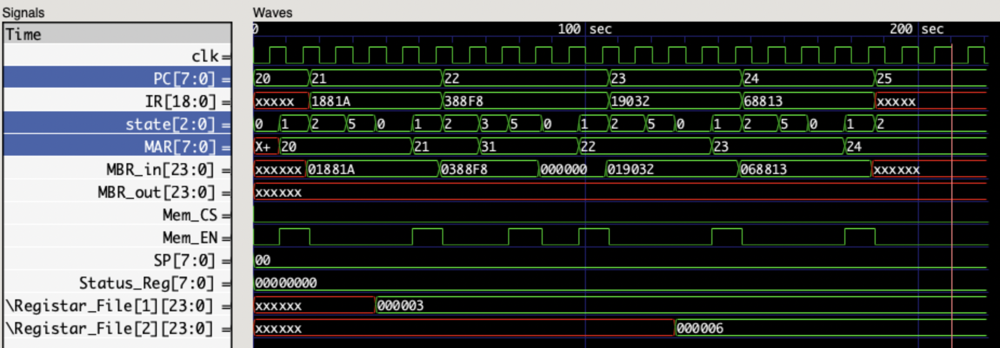
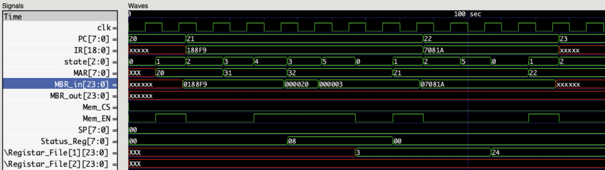
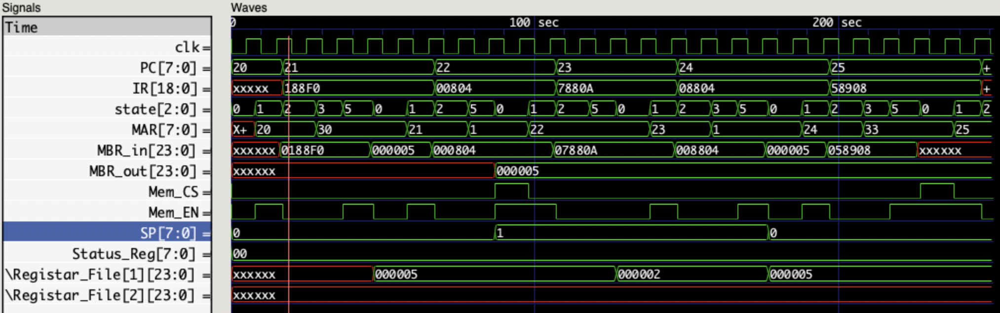

                                      ╔════════════════━━─── • ───━━━═══════════════╗

                                                  Simple Computer In Verilog

                                      ╚═══════════════━━━─── • ───━━━═══════════════╝

-----------


###### View Rendered README on Github [https://github.com/ibraheemalayan/Simple_Computer_Verilog_Part_1](https://github.com/ibraheemalayan/Simple_Computer_Verilog_Part_1.git)

# Simple Computer In Verilog 💻

project 1 phase II in the computer organization course (ENCS2380) at [Birzeit University](https://www.birzeit.edu/)

## Partners 

```
👷 Ibraheem Alyan  1201180
👷 Hammam Khaled   1191081
```

------------------------------

## [Project Paper](https://drive.google.com/file/d/1CynuBT3mAd_htxdpWnm3OeJVcPVh-bn9/view?usp=sharing)

------------------------------

## Modules

* [CPU.v](./modules/CPU.v)
CPU module that can execute the 12 instructions

* [MEMORY.v](./modules/MEM.v)
a 384 byte memory (128 cells each is 3 bytes)    

* [CLK_GEN.v](./modules/CLK_GEN.v)
a sample clock generator that inverts the clock signal each 5 ns (full cycle is 10 ns)    

* [Test_Bench.v](./modules/Test_Bench.v)
the test bench that connects the modules and is the top level file in the simulation        

------------------------------

## Running The Simulation

install [Icarus Verilog](https://github.com/steveicarus/iverilog) and add its binaries to your shell path then run the following

```
git clone https://github.com/ibraheemalayan/Simple_Computer_Verilog_Part_2.git
cd Simple_Computer_Verilog_Part_2/modules
iverilog -o compiled_testbench.vvp Test_Bench.v
vvp compiled_testbench.vvp
```

Then you can read the output of the display statments     
**OR**     
open the [waves.vcd](./modules/waves.vcd) using a wave viewer (eg: GTKwave)    

------------------------------

## Simulations on GTKwave

>>> Visit the link of each simulation to view the **Discussion**, simulation text output, memory table view, memory loading code, and the high quality images links

------------------------------

#### [Simulation 1](Simulation_1.md)


------------------------------

#### [Simulation 2](Simulation_2.md)


------------------------------

#### [Simulation 3](Simulation_3.md)


------------------------------

#### [Simulation 4](Simulation_4.md)


