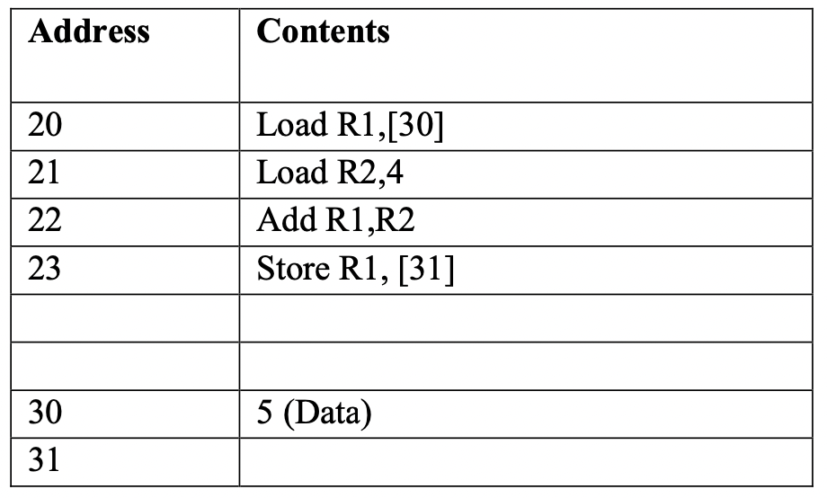
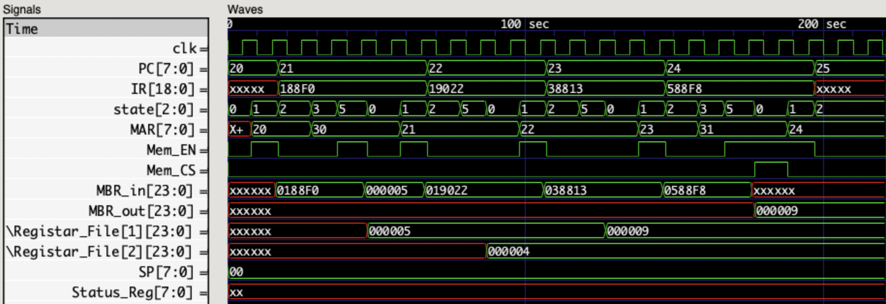

# Simulation 1

## Memory



## Waves File [simulation_1.vcd](./modules/simulation_1.vcd)

## Loading Program In MEM.v

```verilog
    //////////////////////////////////////////////////////
    // simulation 1
    //////////////////////////////////////////////////////

    ///////////// Instructions /////////////
    
    // 20 Load R1,[30]
    Cells [20] = { load, 4'd1, 8'd30, direct };

    // 21 Load R2,4
    Cells [21] = { load, 4'd2, 8'd4, immediate };

    // 22 Add R1,R2
    Cells [22] = { add, 4'd1, 8'd2, register };

    // 23 Store R1, [31]
    Cells [23] = { store, 4'd1, 8'd31, direct };

    ///////////// Data /////////////
    
    // 30 5
    Cells [30] = 19'd5;
```

## Waveform Screenshot

> Note that address fields (MAR, PC) are in decimal format, other fields are hexadecimal

    
[raw high quality image](https://raw.githubusercontent.com/ibraheemalayan/Simple_Computer_Verilog_Part_2/master/img/simulation_1_screenshot.png)


## Discussion 

* value of address [30] which is 5 was loaded into R1
* immediate value 4 was loaded in R2
* value of R1 was added to the value of R2 and saved in R1 (5 + 4 = 9)
* value of R1 was stored at memory address [31]

## Text Output

```
(0) > running the test bench ...


 -------------------------- clock positive edge (t=5) --------------------------


 ~~~~~~~~~~~~~~ New Instruction Cycle ~~~~~~~~~~~~~~

(8) CPU > get_instruction_addr, PC=20


 -------------------------- clock positive edge (t=15) --------------------------


(16) Memory Read operation data_read=188f0 from address 20
(17) CPU > fetch_instruction
(17) CPU > MBR_in = 11000100011110000


 -------------------------- clock positive edge (t=25) --------------------------


(27) CPU > IR = 11000100011110000
(27) CPU > decode_instruction
(28) CPU > decode_instruction : direct, 10:3 is 11110 >> 30 >> 1e


 -------------------------- clock positive edge (t=35) --------------------------


(37) CPU > fetch_operand


 -------------------------- clock positive edge (t=45) --------------------------


(46) Memory Read operation data_read=5 from address 30
(47) CPU > execute


 -------------------------- clock positive edge (t=55) --------------------------


 ~~~~~~~~~~~~~~ New Instruction Cycle ~~~~~~~~~~~~~~

(58) CPU > get_instruction_addr, PC=21


 -------------------------- clock positive edge (t=65) --------------------------


(66) Memory Read operation data_read=19022 from address 21
(67) CPU > fetch_instruction
(67) CPU > MBR_in = 11001000000100010


 -------------------------- clock positive edge (t=75) --------------------------


(77) CPU > IR = 11001000000100010
(77) CPU > decode_instruction
(78) CPU > decode_instruction : immediate


 -------------------------- clock positive edge (t=85) --------------------------


(87) CPU > execute


 -------------------------- clock positive edge (t=95) --------------------------


 ~~~~~~~~~~~~~~ New Instruction Cycle ~~~~~~~~~~~~~~

(98) CPU > get_instruction_addr, PC=22


 -------------------------- clock positive edge (t=105) --------------------------


(106) Memory Read operation data_read=38813 from address 22
(107) CPU > fetch_instruction
(107) CPU > MBR_in = 111000100000010011


 -------------------------- clock positive edge (t=115) --------------------------


(117) CPU > IR = 111000100000010011
(117) CPU > decode_instruction
(118) CPU > decode_instruction : register


 -------------------------- clock positive edge (t=125) --------------------------


(127) CPU > execute


 -------------------------- clock positive edge (t=135) --------------------------


 ~~~~~~~~~~~~~~ New Instruction Cycle ~~~~~~~~~~~~~~

(138) CPU > get_instruction_addr, PC=23


 -------------------------- clock positive edge (t=145) --------------------------


(146) Memory Read operation data_read=588f8 from address 23
(147) CPU > fetch_instruction
(147) CPU > MBR_in = 1011000100011111000


 -------------------------- clock positive edge (t=155) --------------------------


(157) CPU > IR = 1011000100011111000
(157) CPU > decode_instruction
(158) CPU > decode_instruction : direct, 10:3 is 11111 >> 31 >> 1f


 -------------------------- clock positive edge (t=165) --------------------------


(167) CPU > fetch_operand


 -------------------------- clock positive edge (t=175) --------------------------


(176) Memory Read operation data_read=xxxxxx from address 31
(177) CPU > execute


 -------------------------- clock positive edge (t=185) --------------------------


(186) Memory Write operation data_written=9 at 31

 ~~~~~~~~~~~~~~ New Instruction Cycle ~~~~~~~~~~~~~~

(188) CPU > get_instruction_addr, PC=24


 -------------------------- clock positive edge (t=195) --------------------------


(196) Memory Read operation data_read=xxxxxx from address 24
(197) CPU > fetch_instruction
(197) CPU > MBR_in = xxxxxxxxxxxxxxxxxxxxxxxx
(200) > value of cell[32] (hexadecimal) is xxxxxx


 -------------------------- clock positive edge (t=205) --------------------------


(207) CPU > IR = xxxxxxxxxxxxxxxxxxx
(207) CPU > decode_instruction


 -------------------------- clock positive edge (t=215) --------------------------


(217) CPU > IR = xxxxxxxxxxxxxxxxxxx
(217) CPU > decode_instruction
(220) > finishing simulation

```