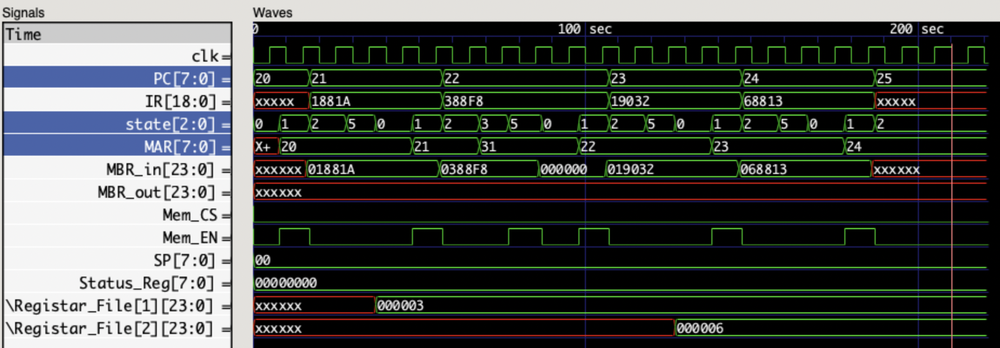

# Simulation 2

## Memory


## Loading Program In MEM.v

```verilog
    //////////////////////////////////////////////////////
    // simulation 2
    //////////////////////////////////////////////////////

    ///////////// Instructions /////////////
    
    // 20 Load R1,3
    Cells [20] = { load, 4'd1, 8'd3, immediate };

    // 21 Add R1,[31]
    Cells [21] = { add, 4'd1, 8'd31, direct };

    // 22 Load R2,6
    Cells [22] = { load, 4'd2, 8'd6, immediate };

    // 23 CMP R1, R2
    Cells [23] = { cmp, 4'd1, 8'd2, register };

    ///////////// Data /////////////
    
    // 30 5
    Cells [30] = 19'd5;
    Cells [31] = 19'd0;
```

## Waveform Screenshot

> Note that address fields (MAR, PC) are in decimal format, other fields are hexadecimal

    
[raw high quality image](https://raw.githubusercontent.com/ibraheemalayan/Simple_Computer_Verilog_Part_2/master/img/simulation_2_screenshot.png)


## Discussion 

* immediate value 3 was loaded in R1
* value of R1 was added to the value of memory location 32 and saved in R1 (3 + 0 = 3)
* immediate value 6 was loaded in R2
* value of R1 and value of R2 where compared and zero flag was set accordingly ( 6 == 3 is false, zero flag wasn't set)

## Text Output

```
(0) > running the test bench ...


 -------------------------- clock positive edge (t=5) --------------------------


 ~~~~~~~~~~~~~~ New Instruction Cycle ~~~~~~~~~~~~~~

(8) CPU > get_instruction_addr, PC=20


 -------------------------- clock positive edge (t=15) --------------------------


(16) Memory Read operation data_read=1881a from address 20
(17) CPU > fetch_instruction
(17) CPU > MBR_in = 11000100000011010


 -------------------------- clock positive edge (t=25) --------------------------


(27) CPU > IR = 11000100000011010
(27) CPU > decode_instruction
(28) CPU > decode_instruction : immediate


 -------------------------- clock positive edge (t=35) --------------------------


(37) CPU > execute


 -------------------------- clock positive edge (t=45) --------------------------


 ~~~~~~~~~~~~~~ New Instruction Cycle ~~~~~~~~~~~~~~

(48) CPU > get_instruction_addr, PC=21


 -------------------------- clock positive edge (t=55) --------------------------


(56) Memory Read operation data_read=388f8 from address 21
(57) CPU > fetch_instruction
(57) CPU > MBR_in = 111000100011111000


 -------------------------- clock positive edge (t=65) --------------------------


(67) CPU > IR = 111000100011111000
(67) CPU > decode_instruction
(68) CPU > decode_instruction : direct, 10:3 is 11111 >> 31 >> 1f


 -------------------------- clock positive edge (t=75) --------------------------


(77) CPU > fetch_operand


 -------------------------- clock positive edge (t=85) --------------------------


(86) Memory Read operation data_read=0 from address 31
(87) CPU > execute


 -------------------------- clock positive edge (t=95) --------------------------


 ~~~~~~~~~~~~~~ New Instruction Cycle ~~~~~~~~~~~~~~

(98) CPU > get_instruction_addr, PC=22


 -------------------------- clock positive edge (t=105) --------------------------


(106) Memory Read operation data_read=19032 from address 22
(107) CPU > fetch_instruction
(107) CPU > MBR_in = 11001000000110010


 -------------------------- clock positive edge (t=115) --------------------------


(117) CPU > IR = 11001000000110010
(117) CPU > decode_instruction
(118) CPU > decode_instruction : immediate


 -------------------------- clock positive edge (t=125) --------------------------


(127) CPU > execute


 -------------------------- clock positive edge (t=135) --------------------------


 ~~~~~~~~~~~~~~ New Instruction Cycle ~~~~~~~~~~~~~~

(138) CPU > get_instruction_addr, PC=23


 -------------------------- clock positive edge (t=145) --------------------------


(146) Memory Read operation data_read=68813 from address 23
(147) CPU > fetch_instruction
(147) CPU > MBR_in = 1101000100000010011


 -------------------------- clock positive edge (t=155) --------------------------


(157) CPU > IR = 1101000100000010011
(157) CPU > decode_instruction
(158) CPU > decode_instruction : register


 -------------------------- clock positive edge (t=165) --------------------------


(167) CPU > execute


 -------------------------- clock positive edge (t=175) --------------------------


 ~~~~~~~~~~~~~~ New Instruction Cycle ~~~~~~~~~~~~~~

(178) CPU > get_instruction_addr, PC=24


 -------------------------- clock positive edge (t=185) --------------------------


(186) Memory Read operation data_read=xxxxxx from address 24
(187) CPU > fetch_instruction
(187) CPU > MBR_in = xxxxxxxxxxxxxxxxxxxxxxxx


 -------------------------- clock positive edge (t=195) --------------------------


(197) CPU > IR = xxxxxxxxxxxxxxxxxxx
(197) CPU > decode_instruction


 -------------------------- clock positive edge (t=205) --------------------------


(207) CPU > IR = xxxxxxxxxxxxxxxxxxx
(207) CPU > decode_instruction


 -------------------------- clock positive edge (t=215) --------------------------


(217) CPU > IR = xxxxxxxxxxxxxxxxxxx
(217) CPU > decode_instruction
(220) > finishing simulation
```