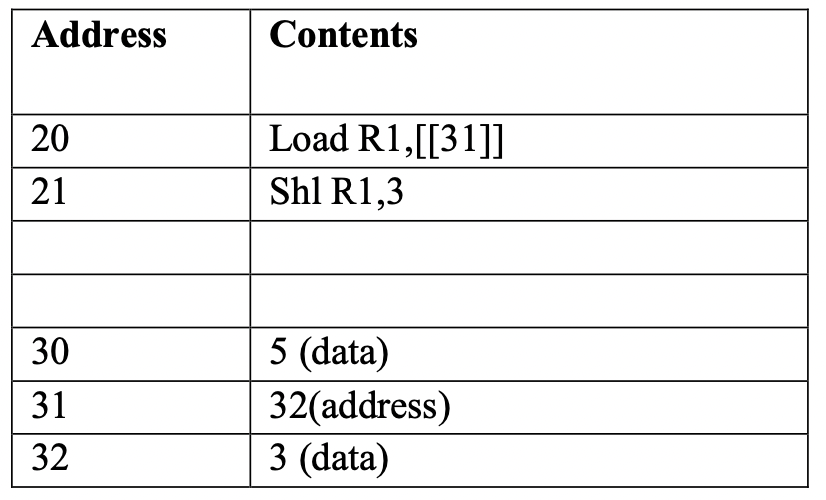

# Simulation 3

## Memory



## Waves File [simulation_3.vcd](./modules/simulation_3.vcd)

## Loading Program In MEM.v

```verilog
    //////////////////////////////////////////////////////
    // simulation 3
    //////////////////////////////////////////////////////

    ///////////// Instructions /////////////
    
    // 20 Load R1,[[31]]
    Cells [20] = { load, 4'd1, 8'd31, indirect };

    // 21 AShl R1,3
    Cells [21] = { sl, 4'd1, 8'd3, immediate };

    ///////////// Data /////////////
    
    // 30 5
    Cells [30] = 19'd5;
    Cells [31] = 19'd32;
    Cells [32] = 19'd3;
```

## Waveform Screenshot

> Note that address fields (MAR, PC) are in decimal format, other fields are hexadecimal

    
[raw high quality image](https://raw.githubusercontent.com/ibraheemalayan/Simple_Computer_Verilog_Part_2/master/img/simulation_3_screenshot.png)


## Discussion 

* value of memory location [31] was loaded as pointer in MAR
* the value of MAR was used as address of the operand (32)
* the operand 3 was loaded from memory location [32] to R1
* R1 was shifted left by 3 ( 0000 0011 (3) became 0001 1000 (24) )

## Text Output

```
(0) > running the test bench ...


 -------------------------- clock positive edge (t=5) --------------------------


 ~~~~~~~~~~~~~~ New Instruction Cycle ~~~~~~~~~~~~~~

(8) CPU > get_instruction_addr, PC=20


 -------------------------- clock positive edge (t=15) --------------------------


(16) Memory Read operation data_read=188f9 from address 20
(17) CPU > fetch_instruction
(17) CPU > MBR_in = 11000100011111001


 -------------------------- clock positive edge (t=25) --------------------------


(27) CPU > IR = 11000100011111001
(27) CPU > decode_instruction
(28) CPU > decode_instruction : indirect


 -------------------------- clock positive edge (t=35) --------------------------


(37) CPU > fetch_operand


 -------------------------- clock positive edge (t=45) --------------------------


(46) Memory Read operation data_read=20 from address 31
(47) CPU > copy_pointer_to_MAR


 -------------------------- clock positive edge (t=55) --------------------------


(56) Memory Read operation data_read=3 from address 32
(57) CPU > fetch_operand


 -------------------------- clock positive edge (t=65) --------------------------


(66) Memory Read operation data_read=3 from address 32
(67) CPU > execute


 -------------------------- clock positive edge (t=75) --------------------------


 ~~~~~~~~~~~~~~ New Instruction Cycle ~~~~~~~~~~~~~~

(78) CPU > get_instruction_addr, PC=21


 -------------------------- clock positive edge (t=85) --------------------------


(86) Memory Read operation data_read=7081a from address 21
(87) CPU > fetch_instruction
(87) CPU > MBR_in = 1110000100000011010


 -------------------------- clock positive edge (t=95) --------------------------


(97) CPU > IR = 1110000100000011010
(97) CPU > decode_instruction
(98) CPU > decode_instruction : immediate


 -------------------------- clock positive edge (t=105) --------------------------


(107) CPU > execute


 -------------------------- clock positive edge (t=115) --------------------------


 ~~~~~~~~~~~~~~ New Instruction Cycle ~~~~~~~~~~~~~~

(118) CPU > get_instruction_addr, PC=22


 -------------------------- clock positive edge (t=125) --------------------------


(126) Memory Read operation data_read=xxxxxx from address 22
(127) CPU > fetch_instruction
(127) CPU > MBR_in = xxxxxxxxxxxxxxxxxxxxxxxx


 -------------------------- clock positive edge (t=135) --------------------------


(137) CPU > IR = xxxxxxxxxxxxxxxxxxx
(137) CPU > decode_instruction


 -------------------------- clock positive edge (t=145) --------------------------


(147) CPU > IR = xxxxxxxxxxxxxxxxxxx
(147) CPU > decode_instruction


 -------------------------- clock positive edge (t=155) --------------------------


(157) CPU > IR = xxxxxxxxxxxxxxxxxxx
(157) CPU > decode_instruction


 -------------------------- clock positive edge (t=165) --------------------------


(167) CPU > IR = xxxxxxxxxxxxxxxxxxx
(167) CPU > decode_instruction


 -------------------------- clock positive edge (t=175) --------------------------


(177) CPU > IR = xxxxxxxxxxxxxxxxxxx
(177) CPU > decode_instruction


 -------------------------- clock positive edge (t=185) --------------------------


(187) CPU > IR = xxxxxxxxxxxxxxxxxxx
(187) CPU > decode_instruction


 -------------------------- clock positive edge (t=195) --------------------------


(197) CPU > IR = xxxxxxxxxxxxxxxxxxx
(197) CPU > decode_instruction


 -------------------------- clock positive edge (t=205) --------------------------


(207) CPU > IR = xxxxxxxxxxxxxxxxxxx
(207) CPU > decode_instruction


 -------------------------- clock positive edge (t=215) --------------------------


(217) CPU > IR = xxxxxxxxxxxxxxxxxxx
(217) CPU > decode_instruction
(220) > finishing simulation
```