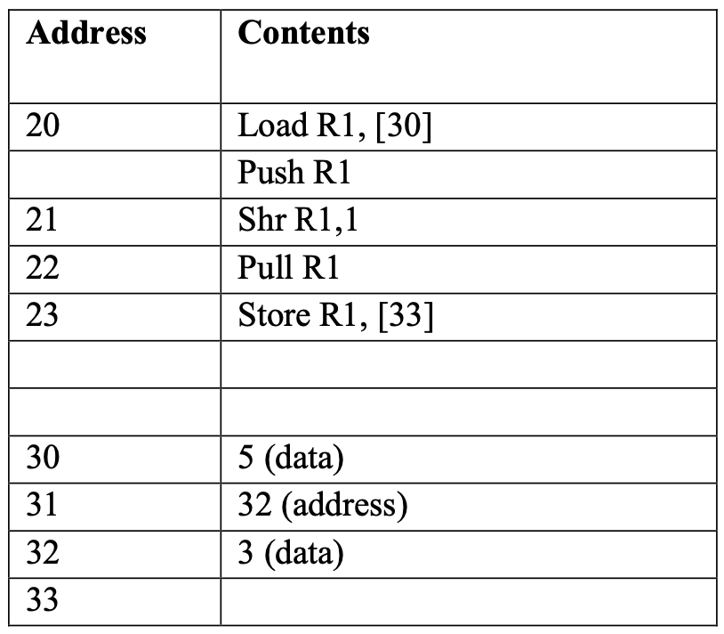

# Simulation 4

## Memory



## Waves File [simulation_4.vcd](./modules/simulation_4.vcd)

## Loading Program In MEM.v

```verilog
    //////////////////////////////////////////////////////
    // simulation 4
    //////////////////////////////////////////////////////

    ///////////// Instructions /////////////
    
    // 20 Load R1, [30]
    Cells [20] = { load, 4'd1, 8'd30, direct };

    // 21 Push R1
    Cells [21] = { push, 4'd1, 8'd0, stack };

    // 22 Shr R1,1
    Cells [22] = { sr, 4'd1, 8'd1, immediate };

    // 23 Pop R1
    Cells [23] = { pop, 4'd1, 8'd0, stack };

    // 24 Store R1, [33]
    Cells [24] = { store, 4'd1, 8'd33, direct };

    ///////////// Data /////////////
    
    // 30 5
    Cells [30] = 19'd5;
    Cells [31] = 19'd32;
    Cells [32] = 19'd3;
```

## Waveform Screenshot

> Note that address fields (MAR, PC) are in decimal format, other fields are hexadecimal

    
[raw high quality image](https://raw.githubusercontent.com/ibraheemalayan/Simple_Computer_Verilog_Part_2/master/img/simulation_4_screenshot.png)


## Discussion 

* value of memory location [30] was loaded in R1 (5) then it was pushed to the stack then the register was shifted rigth ( its value became 2), then the stack was poped in R1 (its value became 5) then it was stored at memory location 33

## Text Output

```
(0) > running the test bench ...


 -------------------------- clock positive edge (t=5) --------------------------


 ~~~~~~~~~~~~~~ New Instruction Cycle ~~~~~~~~~~~~~~

(8) CPU > get_instruction_addr, PC=20


 -------------------------- clock positive edge (t=15) --------------------------


(16) Memory Read operation data_read=188f0 from address 20
(17) CPU > fetch_instruction
(17) CPU > MBR_in = 11000100011110000


 -------------------------- clock positive edge (t=25) --------------------------


(27) CPU > IR = 11000100011110000
(27) CPU > decode_instruction
(28) CPU > decode_instruction : direct, 10:3 is 11110 >> 30 >> 1e


 -------------------------- clock positive edge (t=35) --------------------------


(37) CPU > fetch_operand


 -------------------------- clock positive edge (t=45) --------------------------


(46) Memory Read operation data_read=5 from address 30
(47) CPU > execute


 -------------------------- clock positive edge (t=55) --------------------------


 ~~~~~~~~~~~~~~ New Instruction Cycle ~~~~~~~~~~~~~~

(58) CPU > get_instruction_addr, PC=21


 -------------------------- clock positive edge (t=65) --------------------------


(66) Memory Read operation data_read=804 from address 21
(67) CPU > fetch_instruction
(67) CPU > MBR_in = 100000000100


 -------------------------- clock positive edge (t=75) --------------------------


(77) CPU > IR = 100000000100
(77) CPU > decode_instruction
(78) CPU > decode_instruction : stack


 -------------------------- clock positive edge (t=85) --------------------------


(87) CPU > execute


 -------------------------- clock positive edge (t=95) --------------------------


(96) Memory Write operation data_written=5 at 1

 ~~~~~~~~~~~~~~ New Instruction Cycle ~~~~~~~~~~~~~~

(98) CPU > get_instruction_addr, PC=22


 -------------------------- clock positive edge (t=105) --------------------------


(106) Memory Read operation data_read=7880a from address 22
(107) CPU > fetch_instruction
(107) CPU > MBR_in = 1111000100000001010


 -------------------------- clock positive edge (t=115) --------------------------


(117) CPU > IR = 1111000100000001010
(117) CPU > decode_instruction
(118) CPU > decode_instruction : immediate


 -------------------------- clock positive edge (t=125) --------------------------


(127) CPU > execute


 -------------------------- clock positive edge (t=135) --------------------------


 ~~~~~~~~~~~~~~ New Instruction Cycle ~~~~~~~~~~~~~~

(138) CPU > get_instruction_addr, PC=23


 -------------------------- clock positive edge (t=145) --------------------------


(146) Memory Read operation data_read=8804 from address 23
(147) CPU > fetch_instruction
(147) CPU > MBR_in = 1000100000000100


 -------------------------- clock positive edge (t=155) --------------------------


(157) CPU > IR = 1000100000000100
(157) CPU > decode_instruction
(158) CPU > decode_instruction : stack


 -------------------------- clock positive edge (t=165) --------------------------


(167) CPU > fetch_operand


 -------------------------- clock positive edge (t=175) --------------------------


(176) Memory Read operation data_read=5 from address 1
(177) CPU > execute


 -------------------------- clock positive edge (t=185) --------------------------


 ~~~~~~~~~~~~~~ New Instruction Cycle ~~~~~~~~~~~~~~

(188) CPU > get_instruction_addr, PC=24


 -------------------------- clock positive edge (t=195) --------------------------


(196) Memory Read operation data_read=58908 from address 24
(197) CPU > fetch_instruction
(197) CPU > MBR_in = 1011000100100001000


 -------------------------- clock positive edge (t=205) --------------------------


(207) CPU > IR = 1011000100100001000
(207) CPU > decode_instruction
(208) CPU > decode_instruction : direct, 10:3 is 100001 >> 33 >> 21


 -------------------------- clock positive edge (t=215) --------------------------


(217) CPU > fetch_operand
(220) > finishing simulation


ibraheemalyan@Ibraheems-MacBook-Pro modules % iverilog -o compiled_testbench.vvp Test_Bench.v
ibraheemalyan@Ibraheems-MacBook-Pro modules % vvp compiled_testbench.vvp
(0) > initializing clock generator ...
(0) > initializing memory ...
(0) > initializing CPU ...
VCD info: dumpfile waves.vcd opened for output.
VCD warning: array word TestBench.cpu.Registar_File[1] will conflict with an escaped identifier.
VCD warning: array word TestBench.cpu.Registar_File[2] will conflict with an escaped identifier.
VCD warning: Test_Bench.v:34: $dumpfile called after $dumpvars started,
                              using existing file (waves.vcd).
(0) > running the test bench ...


 -------------------------- clock positive edge (t=5) --------------------------


 ~~~~~~~~~~~~~~ New Instruction Cycle ~~~~~~~~~~~~~~

(8) CPU > get_instruction_addr, PC=20


 -------------------------- clock positive edge (t=15) --------------------------


(16) Memory Read operation data_read=188f0 from address 20
(17) CPU > fetch_instruction
(17) CPU > MBR_in = 11000100011110000


 -------------------------- clock positive edge (t=25) --------------------------


(27) CPU > IR = 11000100011110000
(27) CPU > decode_instruction
(28) CPU > decode_instruction : direct, 10:3 is 11110 >> 30 >> 1e


 -------------------------- clock positive edge (t=35) --------------------------


(37) CPU > fetch_operand


 -------------------------- clock positive edge (t=45) --------------------------


(46) Memory Read operation data_read=5 from address 30
(47) CPU > execute


 -------------------------- clock positive edge (t=55) --------------------------


 ~~~~~~~~~~~~~~ New Instruction Cycle ~~~~~~~~~~~~~~

(58) CPU > get_instruction_addr, PC=21


 -------------------------- clock positive edge (t=65) --------------------------


(66) Memory Read operation data_read=804 from address 21
(67) CPU > fetch_instruction
(67) CPU > MBR_in = 100000000100


 -------------------------- clock positive edge (t=75) --------------------------


(77) CPU > IR = 100000000100
(77) CPU > decode_instruction
(78) CPU > decode_instruction : stack


 -------------------------- clock positive edge (t=85) --------------------------


(87) CPU > execute


 -------------------------- clock positive edge (t=95) --------------------------


(96) Memory Write operation data_written=5 at 1

 ~~~~~~~~~~~~~~ New Instruction Cycle ~~~~~~~~~~~~~~

(98) CPU > get_instruction_addr, PC=22


 -------------------------- clock positive edge (t=105) --------------------------


(106) Memory Read operation data_read=7880a from address 22
(107) CPU > fetch_instruction
(107) CPU > MBR_in = 1111000100000001010


 -------------------------- clock positive edge (t=115) --------------------------


(117) CPU > IR = 1111000100000001010
(117) CPU > decode_instruction
(118) CPU > decode_instruction : immediate


 -------------------------- clock positive edge (t=125) --------------------------


(127) CPU > execute


 -------------------------- clock positive edge (t=135) --------------------------


 ~~~~~~~~~~~~~~ New Instruction Cycle ~~~~~~~~~~~~~~

(138) CPU > get_instruction_addr, PC=23


 -------------------------- clock positive edge (t=145) --------------------------


(146) Memory Read operation data_read=8804 from address 23
(147) CPU > fetch_instruction
(147) CPU > MBR_in = 1000100000000100


 -------------------------- clock positive edge (t=155) --------------------------


(157) CPU > IR = 1000100000000100
(157) CPU > decode_instruction
(158) CPU > decode_instruction : stack


 -------------------------- clock positive edge (t=165) --------------------------


(167) CPU > fetch_operand


 -------------------------- clock positive edge (t=175) --------------------------


(176) Memory Read operation data_read=5 from address 1
(177) CPU > execute


 -------------------------- clock positive edge (t=185) --------------------------


 ~~~~~~~~~~~~~~ New Instruction Cycle ~~~~~~~~~~~~~~

(188) CPU > get_instruction_addr, PC=24


 -------------------------- clock positive edge (t=195) --------------------------


(196) Memory Read operation data_read=58908 from address 24
(197) CPU > fetch_instruction
(197) CPU > MBR_in = 1011000100100001000


 -------------------------- clock positive edge (t=205) --------------------------


(207) CPU > IR = 1011000100100001000
(207) CPU > decode_instruction
(208) CPU > decode_instruction : direct, 10:3 is 100001 >> 33 >> 21


 -------------------------- clock positive edge (t=215) --------------------------


(217) CPU > fetch_operand


 -------------------------- clock positive edge (t=225) --------------------------


(226) Memory Read operation data_read=xxxxxx from address 33
(227) CPU > execute


 -------------------------- clock positive edge (t=235) --------------------------


(236) Memory Write operation data_written=5 at 33

 ~~~~~~~~~~~~~~ New Instruction Cycle ~~~~~~~~~~~~~~

(238) CPU > get_instruction_addr, PC=25


 -------------------------- clock positive edge (t=245) --------------------------


(246) Memory Read operation data_read=xxxxxx from address 25
(247) CPU > fetch_instruction
(247) CPU > MBR_in = xxxxxxxxxxxxxxxxxxxxxxxx
(250) > finishing simulation
```